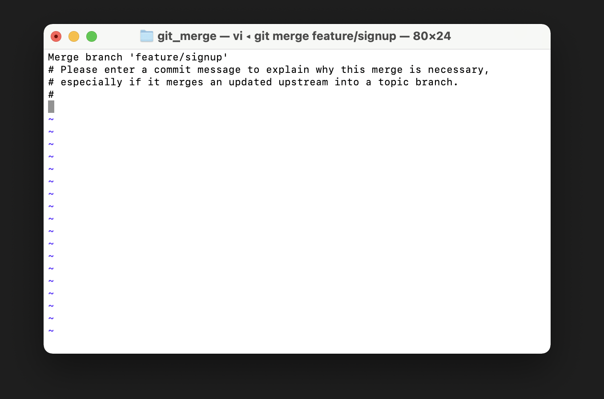

[toc]

# branch scenario

### 1. branch 사용법

```bash
# 4개 정도 commit을 남기고 시작한다.
$ git log --oneline
0f0ab00 (HEAD -> master) text 3
706faf6 text 2
eebf263 text 1
7d8c0e4 Finish a.txt
```

- `HEAD` 

  - 현재 위치한 브랜치의 최신 commit을 가리키는 (일종의) 포인터
  - 현재 `HEAD`는 다음 commit의 부모 commit이 된다.

  - 현재 내가 어떤 곳에 위치해있는지를 알 수 있다.


```bash
# 브랜치 생성
$ git branch feature/login
$ git branch
  feature/login
* master

$ git log --oneline
0f0ab00 (HEAD -> master, feature/login) text 3
706faf6 text 2
eebf263 text 1
7d8c0e4 Finish a.txt

```

```bash
# a.txt

text 1
text 2
text 3
master text 4 # master 브랜치에서 작성
```

```bash
$ git add .
$ git commit -m "master text 4"
[master 3173bc7] master text 4
 1 file changed, 2 insertions(+), 1 deletion(-)
```


```bash
$ git log --oneline
3173bc7 (HEAD -> master) master text 4 # 현재 내가 위치한 master 브랜의 최신 commit
0f0ab00 (feature/login) text 3 # feature/login 브랜치의 commit
706faf6 text 2
eebf263 text 1
7d8c0e4 Finish a.txt
```


브랜치 이동

```bash
$ git checkout feature/login
Switched to branch 'feature/login'

$ git log --oneline
0f0ab00 (HEAD -> feature/login) text 3
706faf6 text 2
eebf263 text 1
7d8c0e4 Finish a.txt

```

```bash
# a.txt (feature/login 브랜치에서 작성)
text 1
text 2
text 3
login text 4
```


## 2. Branch Merge

> **브랜치를 생성할 때 master 브랜치에 첫 commit을 남겨 놓고 진행해야 함!!**

```bash
# 기본 준비

$ mkdir git_merge && cd git_merge
$ git init
$ touch a.txt  # 내용 채우고
$ git add .
$ git commit -m "master text 1"
```


### 2-1. fast-forward

> 다른 브랜치가 생성된 이후에 master 브랜치에 변경사항이 없는 경우

-  단순히 포인터를 최신 commit으로 옮기는 방식


```bash
# 브랜치 생성 & 이동
$ git checkout -b feature/login
Switched to a new branch 'feature/login'

# login 작업 진행
$ touch login.txt
$ git add .
$ git commit -m "login test 1"
[feature/login 84ae69b] login test 1
 1 file changed, 0 insertions(+), 0 deletions(-)
 create mode 100644 login.txt

# log 
$ git log --oneline
84ae69b (HEAD -> feature/login) login test 1
da5f933 (master) master text 1

# master 브랜치로 이동
$ git checkout master
Switched to branch 'master'

# log
$ git log --oneline
da5f933 (HEAD -> master) master text 1

# merge
$ git merge feature/login
Updating da5f933..84ae69b
Fast-forward
 login.txt | 0
 1 file changed, 0 insertions(+), 0 deletions(-)
 create mode 100644 login.txt
 
 # branch 삭제
$ git branch -d feature/login
Deleted branch feature/login (was 84ae69b).

# log
$ git log --oneline
84ae69b (HEAD -> master) login test 1
da5f933 master text 1
```


### 2-2. Merge commit - 충돌 x

> 다른 브랜치가 생성된 이후에 master 브랜치에 변경사항이 있는 경우 

- `master` 브랜치와 `feature/signup`  브랜치에 모두 commit 발생
- 하지만 다른 파일을 수정 했기 때문에 merge 과정에서 충돌이 발생하지 않음 


```bash
# 브랜치 생성 후 이동
$ git checkout -b feature/signup
Switched to a new branch 'feature/signup'

# 회원 가입 기능 구현 완료(commit)
$ touch signup.txt
$ git add .
$ git commit -m "singup text 1"
[feature/signup 7019b0f] singup text 1
 1 file changed, 0 insertions(+), 0 deletions(-)
 create mode 100644 signup.txt

# log
$ git log --oneline
7019b0f (HEAD -> feature/signup) singup text 1
84ae69b (master) login test 1
da5f933 master text 1

# master 브랜치로 이동 & commit 발생 시키기
$ git checkout master
$ touch master.txt
$ git add .
$ git commit -m "master text 1"

# merge -> vs code가 열림 -> 닫아주면 자동으로 merge commit 발생
# 충돌이 발생하지 않고 자동으로 merge
$ git merge feature/signup
Merge made by the 'recursive' strategy.
 signup.txt | 0
 1 file changed, 0 insertions(+), 0 deletions(-)
 create mode 100644 signup.txt
 
# log
$ git log --all --oneline --graph
*   af45c80 (HEAD -> master) Merge branch 'feature/signup'
|\
| * 7019b0f (feature/signup) singup text 1
* | 4584405 master text 1
|/
* 84ae69b login test 1
* da5f933 master text 1

# branch 확인 & 삭제
$ git branch
  feature/signup
* master

$ git branch -d feature/signup
Deleted branch feature/signup (was 7019b0f).

# log
$ git log --all --oneline --graph
*   af45c80 (HEAD -> master) Merge branch 'feature/signup'
|\
| * 7019b0f singup text 1
* | 4584405 master text 1
|/
* 84ae69b login test 1
* da5f933 master text 1


```


- 참고 
  - 혹시나 아래와 같은 화면이 나타나면서 움직이지 않는다면?
  - `esc` + `:wq` + `enter` !! 


### 2-3. Merge commit - 충돌 o

> 다른 브랜치가 생성된 이후에 master 브랜치에 변경사항이 있는 경우 

- 변경 사항이 겹쳐서 git이 어떤 내용으로 병합해야 할 지 알 수 없는 경우 


```bash
# branch 생성 후 이동
$ git checkout -b hotfix
Switched to a new branch 'hotfix'

```

```bash
# hotfix 브랜치에서 test.txt 수정

master test 1
이건 hotfix 브랜치에서 작성
했습니다.
```


```bash
# commit 남기기
$ git add .
$ git commit -m "hotfix test 1"
[hotfix abfd4e1] hotfix test 1
 1 file changed, 3 insertions(+), 1 deletion(-)
 
 # master branch로 이동
 $ git checkout master
Switched to branch 'master'

# log
$ git log --oneline --all --graph
* abfd4e1 (hotfix) hotfix test 1
*   af45c80 (HEAD -> master) Merge branch 'feature/signup'
|\
| * 7019b0f singup text 1
* | 4584405 master text 1
|/
* 84ae69b login test 1
* da5f933 master text 1
```


```bash
# master 브랜치에서 test.txt 수정

master test 1
이건 master 브랜치에서
작성했습니다.
```


```bash
# commit 남기기

$ git add .
$ git commit -m "master test 1"
[master 49e9116] master test 1
 1 file changed, 3 insertions(+), 1 deletion(-)
 
# log
$ git log --oneline --all --graph
* 49e9116 (HEAD -> master) master test 1
| * abfd4e1 (hotfix) hotfix test 1
|/
*   af45c80 Merge branch 'feature/signup'
|\
| * 7019b0f singup text 1
* | 4584405 master text 1
|/
* 84ae69b login test 1
* da5f933 master text 1
```


```bash
# merge 이후에 아래 에러 발생
$ git merge hotfix
Auto-merging test.txt
# 충돌 발생... -> merge 충돌이 test.txt에서 발생했음
CONFLICT (content): Merge conflict in test.txt
# 자동으로 병합(merge)하는 것을 실패했어요.. -> 충돌을 고치고나서 commit해주세요..
Automatic merge failed; fix conflicts and then commit the result.
```


vs code에 다음과 같은 메시지가 나타남

- master 브랜치에서 변경한 내용으로 합칠지 hotfix 브랜치에서 변경한 내용을 합칠지 git은 알 수 없기 때문에 직접 선택해서 알려줘야 함

- 아래와 같이 내용을 수정

  ```bash
  # test.txt
  
  master test 1
  Merge 충돌을 해결했습니다!
  ```


```bash
student@M174 MINGW64 ~/Desktop/git_merge (master|MERGING) # Merge Commit을 남겨주세요!

$ git status
On branch master
You have unmerged paths.
  (fix conflicts and run "git commit")
  (use "git merge --abort" to abort the merge)

Unmerged paths:
  (use "git add <file>..." to mark resolution)
        both modified:   test.txt # 두 개의 브랜치에서 모두 test.txt에 대한 파일 수정이 발생! 

no changes added to commit (use "git add" and/or "git commit -a")

# 충돌이 발생한 부분을 해결하고 해결했다는 commit을 남겨야함!!
$ git add .
$ git commit -m "Finish resolve conflict"
[master 8580848] Finish resolve conflict

# log
$ git log --oneline --all --graph
*   8580848 (HEAD -> master) Finish resolve conflict
|\
| * abfd4e1 (hotfix) hotfix test 1
* | 49e9116 master test 1
|/
*   af45c80 Merge branch 'feature/signup'
|\
| * 7019b0f singup text 1
* | 4584405 master text 1
|/
* 84ae69b login test 1
* da5f933 master text 1

# branch 삭제
$ git branch -d hotfix
Deleted branch hotfix (was abfd4e1).

# log
$ git log --oneline --graph
*   8580848 (HEAD -> master) Finish resolve conflict
|\
| * abfd4e1 hotfix test 1
* | 49e9116 master test 1
|/
*   af45c80 Merge branch 'feature/signup'
|\
| * 7019b0f singup text 1
* | 4584405 master text 1
|/
* 84ae69b login test 1
* da5f933 master text 1

```

