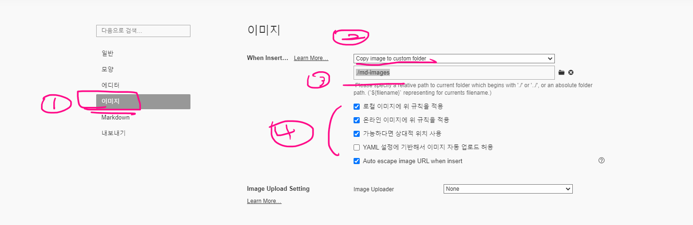

# 이건 대제목입니다.

문서의 구조를 잡기 위해 활용된다. 제목의 레벨에 맞춰서 `#`으로 표현한다.  이때 반드시 `#` 다음에 공백을 두고 enter를 눌러야 한다.

## 이건 h2입니다.

### 이건 h3입니다.

#### h4입니다.

#### h5입니다.

##### h6입니다


# 이렇게 h1을 한번 더 쓰면??? 안된다!!


---

`---` (하이픈)를 3번 입력하고 enter를 누르면 구분선이 그어집니다!


## 목록

- ㄴㅇㄹ
  - ㄴㅇㄹ
    - 

- 순서가 없는 목록
- unordered list라고 부릅니다. 
  - tab하여 다음 단으로 들어갈 수 있고
  - enter를 눌러서 계속 쓰다가 
- shift + tab을 눌러 상단으로 나올 수 있습니다.
- 만약 목록을 끝내고 싶으면?
- enter를 두번 누르면 됩니다.

1. 순서가 있는 목록
2. 얘도 tab으로
   1. 다음 단으로 들어갈 수 있습니다.
   2. 만약에 계속 쓰다가 나오고 싶으면?
3. shift + tab으로 나올 수 있습니다.
   - 이렇게 순서가 있는 목록에 순서가 없는 목록을 같이 쓸 수 있습니다.
4. 완전히 끝내려면 enter를 두 번 누르면 됩니다.


---

## 코드블록

```bash
$ touch a.txt # touch라는 명령어는 a.txt와 같은 파일을 생성하는 명령어다.
```

```html
<h1>
    헤드라인
</h1>
```


```bash
$ mkdir java-projects  # 폴더 생성(make directory)
$ cd java-projects # 폴더 이동 (change directory)
$ touch a.txt  # 파일 생성
$ ls # 파일/폴더 목록 보기(list)
```

` 백틱(숫자 1 옆에 있는 기호) 을 3개 입력하고 원하는 프로그래밍 언어, bash 등과 같은 환경을 입력하면 문법 하이라이팅 기능을 제공한다.


`$ touch b.txt` 한 줄 짜리 코드 하이라이팅을 하려면 백틱(`)으로 둘러싸면된다.


---

## 표 

만들고자 하는 표의 컬럼을 `|(파이프 -> enter key 위쪽에 있음)` 로 감싸서 지정할 수 있음 

|  이름  | 나이 | 생년월일   |      |
| :----: | ---- | ---------- | ---- |
| 홍길동 | 100  | 1400.04.04 |      |
|        |      |            |      |
|        |      |            |      |


---


## 이미지

``

- 절대 경로 
  - 첫 시작부터 끝까지 모든 주소를 하나하나 다 입력
- 상대 경로
  - 현재 마크다운 문서를 기준으로 이미지가 어디에 위치해 있는지





---

## 링크 걸기 

`[](여기에 링크를 넣으면 됩니다)`

랜덤 이미지는 [lorem picsum](https://picsum.photos/200/300) 에서 확인할 수 있습니다.


## 기타 

*기울림(이탤릭)*은 `*`로 감싸줍니다.

**굵게(보드체)**는 `**`로 감싸줍니다.

만약에 바로 쓰고 싶다면? **하하하하** `ctrl + b`

~~취소선~~ 은 `~~`로 감싸줍니다.


> 인용구를 쓸 수 있습니다. `> + space`를 누르면 됩니다.
>
> 이렇게 추가를 하다가 
>
> enter를 두번 누르면 나올 수 있습니다.

